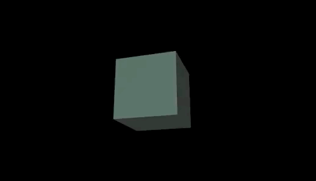

# Adding a light


Before we can add a light and make it work we will need to change out MeshBasicMaterial into one that can be affected by light. We can use `MeshPhongMaterial`, `MeshStandardMaterial`, or `MeshPhysicalMaterial`. For this we will use Phong since it seems to be the best for performance.

```js
// Add a light
const directionalLight = new THREE.DirectionalLight('#FFF', 1)
scene.add(directionalLight)

// const boxMat = new THREE.MeshBasicMaterial({ color: "#465" })
const boxMat = new THREE.MeshPhongMaterial({ color: "#465" })
```
> A directional light by default will point towards (0, 0, 0)

## Light types
There a couple useful types of lights
- `AmbientLight` - Lights everything
- `HemisphereLight` - Lights everything top to bottom
- `DirectionalLight` - Points towards a target
- `PointLight` - Like a lightbulb

## Helpers
Those two lights can attach a helper

```js
// PointLightHelper
const lightHelper = new THREE.PointLightHelper(light, 1, '#F22');

// DirectionalLightHelper
const lightHelper = new THREE.DirectionalLightHelper(light, 1, '#F22');
```

## Directional Light Target
A Directional Light uses a target which is an object that can be added to the scene and moved around. You can also assign any object that has a `.position` property on it!
