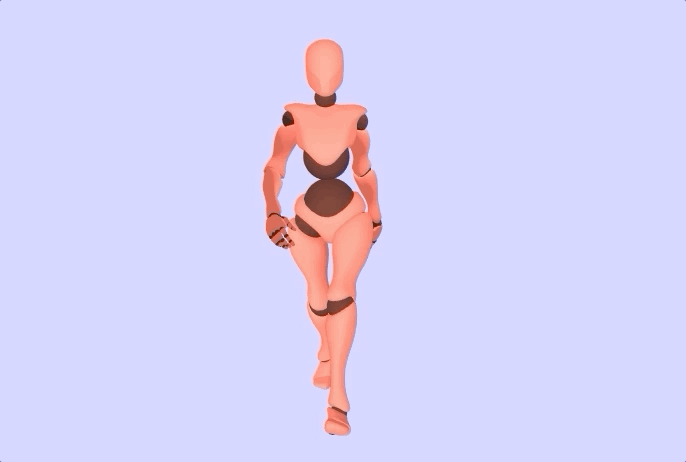
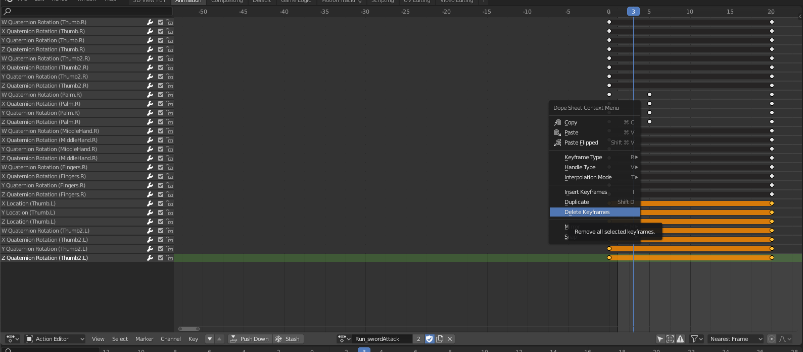

# Animations additive blending


To make a clip additive you have to convert it before using `clipAction`

```js
THREE.AnimationUtils.makeClipAdditive(object.animations[2])
const shakingHeadAnimation = this.mixer.clipAction(object.animations[2])
```

Now when we play and set its weight we it does not completely override the current playing animation
```js
shakingHeadAnimation.enabled = true
shakingHeadAnimation.setEffectiveWeight(1)
shakingHeadAnimation.play()
```


## Fixing models form internet
To make an animation be additive it can be edited in blender and then the bones you do not need in the animation can be deleted from the animation clip

> Here I want to remove the left arm and legs from the animation to keep just the swing of the sword. I select the bones labeled .l in the dope sheet. Rightclick. Then click delete keyframe!

