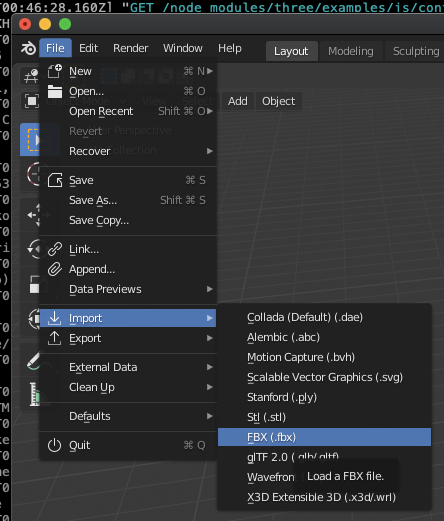
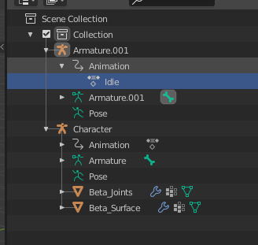
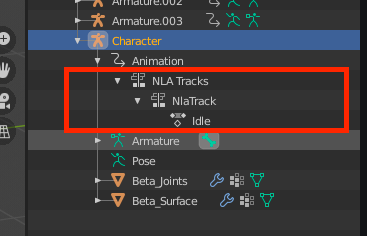
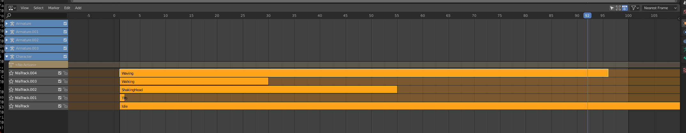

# Converting / Combining .fbx files into a single gltf
Need to convert and combine some files from mixamo into a single fbx file.

## Get the files
In mixamo download 1 of the files with skin and all the others without

## Combine them using blender
1. Open blender and delete everything out of the scene

1. Import each .fbx and make sure to check the settings `Transform > Manual Orientation` and `Armature > Automatic Bone Orientation`

   
   

1. On the model you imported with skin rename it to `Character` and on the others you only need to change the name of the animation

   
1. Once all the models have been imported. Select the character model. Then open dopesheet, switch to action editor.

1. Select an animation to test and click play. The animation will run on the model!

1. Now go through the list. Selecting each animation then clicking `Push Down` this will add the animation to NLA tracks under `Character > Animation > NLA Tracks`

   

1. Once all have been "pushed down" select one animation (I selected tpos) and down click anything else now we hav eone main animation and a bunch of NLA Tracks showing in Scene Collection under character
1. Switch from dopesheet to Nonlinear Animations and we can see out animations and can also rename them

   

1. Delete all the other Armatures so that only the Character model remains
1. Export as gtlf!
1. Test on https://gltf-viewer.donmccurdy.com/
