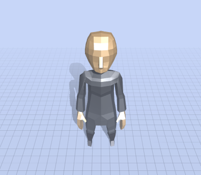
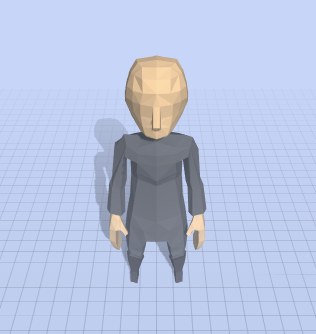

# Flat Models
An issue I ran into while importing a model was when it was imported it looks  shiny



To fix this we can traverse through the loaded model to find its materials and change remove the `reflectivity` and `shininess` and turn on flatShading!

```js
object.traverse((child) => {
   if (child.material) {
      for (const material of child.material) {
         material.flatShading = true
         material.reflectivity = 0
         material.shininess = 0
      }
   }
})
```

Yay!


