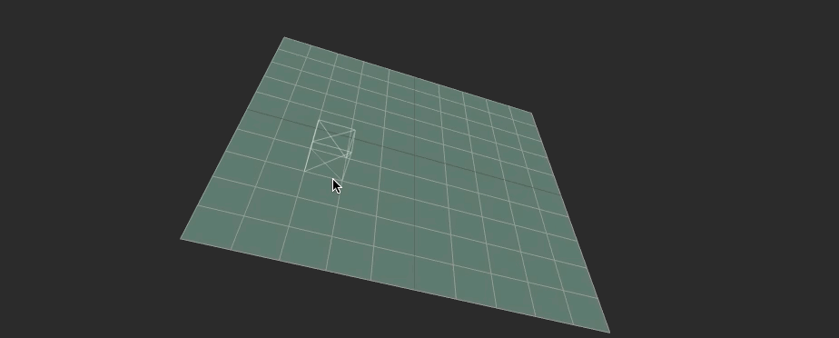

# Axis Aligned Grid Raycast Position


```js
// Axis Aligned

const planeGeo = new THREE.PlaneGeometry(10, 10)
const planeMat = new THREE.MeshPhongMaterial({ color: '#465' })
const planeMes = new THREE.Mesh(planeGeo, planeMat)
planeMes.rotation.y += Math.PI*2
scene.add(planeMes)

const gridHelper = new THREE.GridHelper(10, 10)
gridHelper.rotation.x += Math.PI/2
gridHelper.position.z += 0.01
scene.add(gridHelper)


const boxGeo = new THREE.BoxGeometry()
const boxMat = new THREE.MeshBasicMaterial({ wireframe: true, color: '#FFF', opacity: 0.2, transparent: true })
const boxMes = new THREE.Mesh(boxGeo, boxMat)
boxMes.position.z += 0.5
scene.add(boxMes)


const rayCaster = new THREE.Raycaster()


const render = function() {

   rayCaster.setFromCamera(mousePos, camera)
   const intersections = rayCaster.intersectObject(this.plane)

   if (intersections.length) {
      const intersection = intersections[0]
      this.box.position.copy(intersection.point)
      this.box.position.z += 0.5
      
      const box = new THREE.Box3().setFromObject(plane)
      const planeWidth = box.max.x - box.min.y
      
      const xStart = (plane.position.x - planeWidth/2)
      const yStart = (plane.position.y - planeWidth/2)
      const relativeX =  intersection.point.x - xStart
      const relativeY = intersection.point.y - yStart
      
      const xLock = Math.floor(relativeX)
      const yLock = Math.floor(relativeY)
      
      box.position.x = xStart + xLock + 0.5
      box.position.y = yStart + yLock + 0.5
   }
}
```
