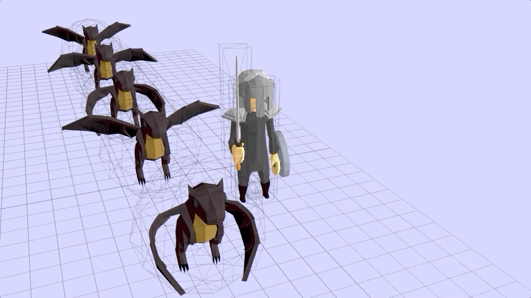

# Multiple objects sharing the same model


```js
const dragonModel = { a model that has been loaded }
const mixers = []

for (let i = 0; i < 5; i++) {
   const dragonModel = THREE.SkeletonUtils.clone(dragonModel.object)
   const dragonGeo = new THREE.SphereGeometry(2)
   const dragonMes = new THREE.Mesh(dragonGeo, wireFrameMat)
   dragonMes.add(dragonModel)
   dragonModel.position.y -= 2 // to put dragon within sphere
   dragonMes.position.set(15, 3, -15+i*6)
   scene.add(dragonMes)

   // SkeletonUtils.clone does not clone AnimationMixer
   const mixer = new THREE.AnimationMixer(dragonModel)
   dragonModel.object.animations.forEach((animation) => {
      const clip = mixer.clipAction(animation)
      clip.setEffectiveWeight(0)
      clip.play()

      if (animation.name === 'DragonArmature|Dragon_Flying') {
         clip.time = Math.random() * 15 // offsetting the animation for others
         clip.setEffectiveWeight(1)
         clip.enabled = true
      }
   })

   // pushing models to an array so we can loop over their AnimationMixer
   mixers.push(mixer)
}


function render() {
   for (const mixer of mixers) {
      mixer.update(clock.getDelta)
   }
}

```
