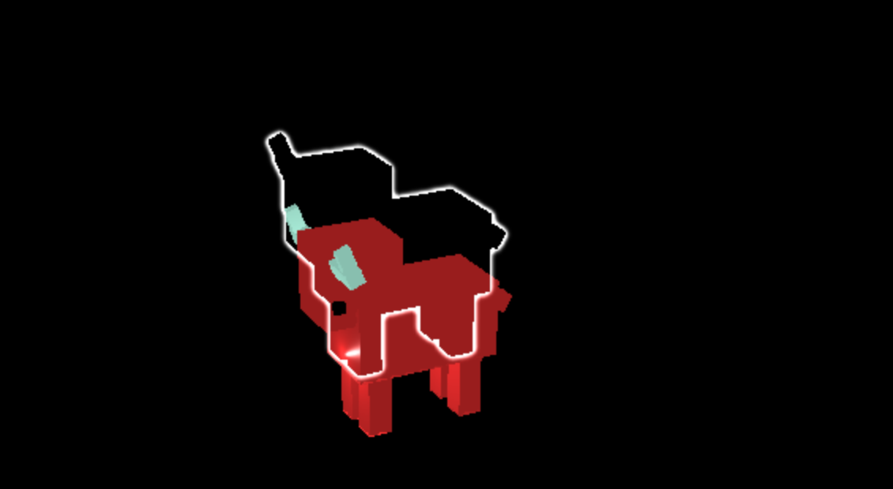
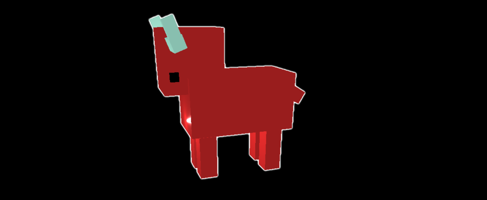

# Outline Notes

While setting out OutlinePass came across problem with outlines being off on some models



Within blender make sure both the model and amature position is applied.

- Select in object mode
- Press `CTRL-a`
- Apply location





# Outline Animated Mesh
The newer versions of three should work out of the box. Going up to r124 you can manually edit OutlinePass.js and add

```
   this.prepareMaskMaterial.skinning = true;
   this.depthMaterial.skinning = true;
```