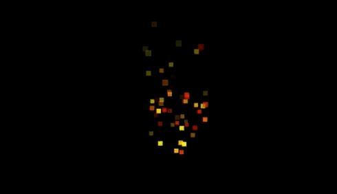

# Particle notes




### Creating particles using THREE.Points
Points are stored in a syncronous array
```js

// geo / mat
const geometry = new THREE.BufferGeometry()
const material = new THREE.PointsMaterial({ size: 1 })

// positions
var arrPoints = [x0, y0, z0, x1, y1, z1, xn, xy, xz...]
const positions = new THREE.Float32BufferAttribute(arrPoints, 3)
this.geometry.setAttribute('position', positions)

// point object
const object = new THREE.Points(geometry, material)
   
```


### Coloring particles
- Make sure THREE.js is at r127+
- pass transparent: true into PointsMaterial

```js
const colors = new THREE.Float32BufferAttribute(arrColors, 4)

this.geometry.setAttribute('color', colors)
```


### Drawing a circle
Draw a circle to a canvas. Give it 100% color space (100% r, 100% g, 100% b).


```js
// create a circle using canvas
var canvas = document.createElement('canvas')
var ctx = canvas.getContext('2d')
canvas.width = 25 // resolution
canvas.height = 25
ctx.fillStyle = '#FFF' // give it 100% of the color space. remove it later
ctx.beginPath()
ctx.arc(canvas.width/2, canvas.height/2, canvas.height/2, 0, 2 * Math.PI)
ctx.fill()


// put it in a texture. Use CanvasTexture or use a normal texture and set needsUpdate=true
const circleTexture = new THREE.CanvasTexture(canvas)

// material with a sprite
this.material = new THREE.PointsMaterial({
    size: 1,
    vertexColors: true,
    transparent: true,
    depthTest: false,
    map: circleTexture,
})
```


