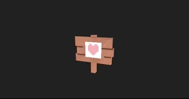
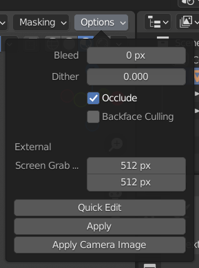
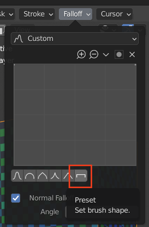

# Pixel Texture notes


Video on pixel perfect textures in blender: https://www.youtube.com/watch?v=RQVAUaSUP-k

**NOTE: USE .glb EXPORT from blender!** Experienced a lot of issues trying to use FBX export for models with textures. Use glb export. You can export textures individually or the glb export with export just one. If you use multiple textures and load them externally the material type in blender does not matter!

### Loading Texture
```js
new THREE.TextureLoader().load('../../assets/blender_practice/pixel_sign.png', (texture) => {
   // for some reason textures are upside down?
   texture.flipY = false
   
   // use nearest for crisp pixels
   texture.magFilter = THREE.NearestFilter
   texture.minFilter = THREE.NearestFilter
})
```

### Applying texture
```js
// when done loading. apply the texture to the model
object_glb.material.map = textureObject
object_glb.material.needsUpdate = true
```

### Blender texture paint settings
- Under options set bleed to 0px
- Make sure backface is off



- Set falloff to the square / line setting


