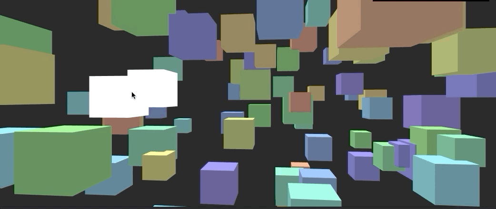

# Raycaster


use a raycaster to find an intersection with 3d objects

```js
// create it
const rayCaster = new THREE.Raycaster()

// Track mouse pos
const mousePos = new Vector2()
window.addEventListener('mousemove', (e) => {
   // (-1 <-> 1, -1 <-> 1)
   const x = (e.clientX / window.innerWidth) * 2 - 1
   const y = -(e.clientY / window.innerHeight) * 2 + 1 // we flip the y
   mousePos.set(x, y)
})

function render() {
   this.rayCaster.setFromCamera(mousePos, camera)
   this.intersects = this.rayCaster.intersectObjects(scene.children, true)
   
   // returns an array of intersects 
   // { distance, point, object, etc }!
   for (const intersect of this.intersects) {
      intersect.object.material.color.set('#FFF')
   }
}
```
