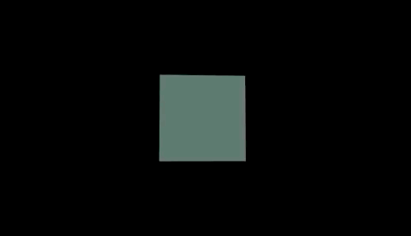

# Rendering a basic cube




## Basic three camera setup and render loop
```js
const scene = new THREE.Scene();
const camera = new THREE.PerspectiveCamera(75, window.innerWidth/window.innerHeight, 0.1, 1000);

const renderer = new THREE.WebGLRenderer();
renderer.setSize(window.innerWidth, window.innerHeight);
document.body.appendChild(renderer.domElement);
```


## Creating out first mesh
A mesh is made of geometry and material
- `geometry` - the points
- `material` - the color / texture

For a bow we will use `BoxGeometry` and `MeshBasicMaterial`
```js
const geometry = new THREE.BoxGeometry();
const material = new THREE.MeshBasicMaterial({ color: '#465' });
const box = new THREE.Mesh(geometry, material);

// add it to the scene!
scene.add(cube);
```

Back up the camera to see the cube
```js
camera.position.z = 5;
```

To rotate the cube we can add a render loop and rotate the mesh
```js
   function render() {
      window.requestAnimationFrame(render)

      // rotate the box
      box.rotation.x += 0.01
      box.rotation.y += 0.01
   }

   window.requestAnimationFrame(render)
```


Our box looks very flat. The fix this we will add some lights

[Next: Adding a light](./adding-a-light.md)
