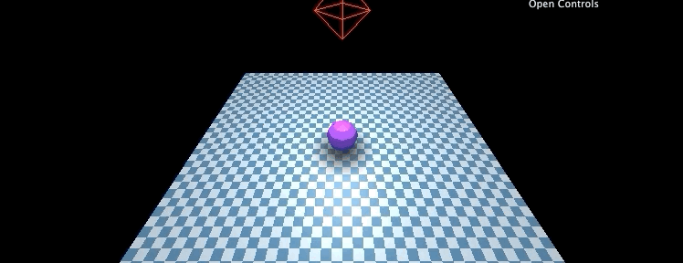
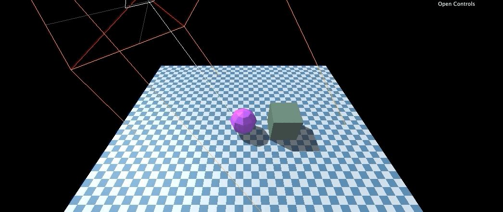
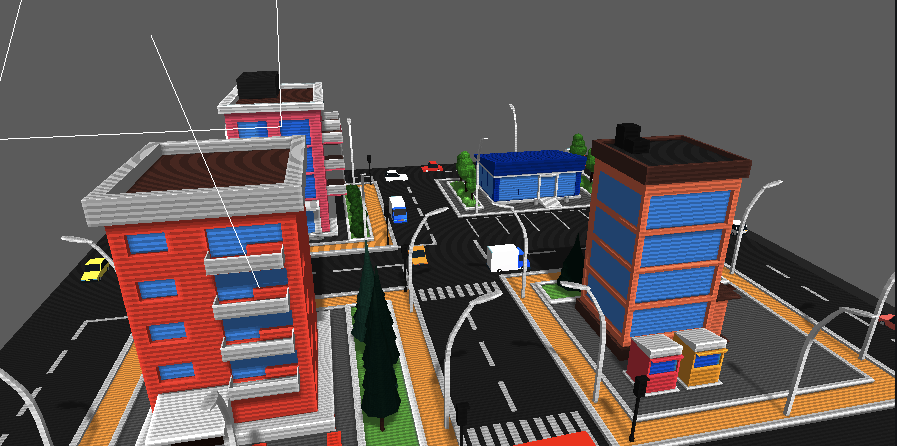
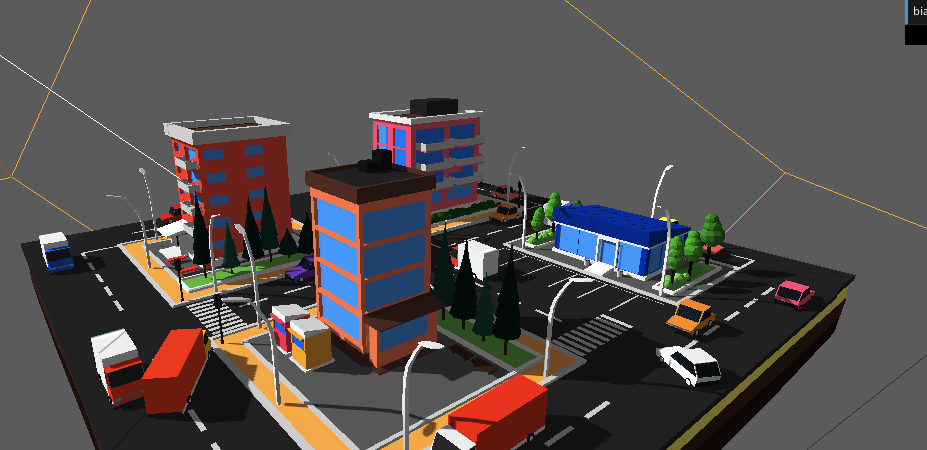

# Shadows
There are many ways to do shadows. We can use three to cast shadows from a point or directional light. We can also make fake shadows using a texture!

# Fake lights using a texture


Using a plane and a transparent texture we can make a fake shadow.

Make a plane with a shadow texture
```js
// Load texture
const shadowTexture = loader.load('./src/assets/roundshadow.png');

// Create a plane and apply the texture
const shadowGeometry = new THREE.PlaneBufferGeometry();
const shadowMaterial = new THREE.MeshBasicMaterial({ map: shadowTexture, transparent: true });
const shadowMesh = new THREE.Mesh(shadowGeometry, shadowMaterial);

// Move it above the ground plane and size it
shadowMesh.rotation.x = Math.PI * -0.5;
shadowMesh.position.y += 0.001;
shadowMesh.scale.set(5, 5, 5);

// Don't forget to add to scene :]
scene.add(shadowMesh);
```

Based on the height of the object we are making a shadow for we can adjust the opacity!
```js
shadowMesh.material.opacity = THREE.Math.lerp(1, 0.25, zeroToOne)
```


# Shadows using renderer / shadow maps


We can cast shadows using a light (Direction, Point, Spot)

Before anything we need to enable shadows

```js
renderer.shadowMap.enabled = true;
```

For the plane we will set `receiveShadow` and the shapes we will add `receiveShadow` and `castShadow`!

```js
// the floor plane only receives
floorMesh.receiveShadow = true

// shapes both receive and cast
shapeMesh.receiveShadow = true
shapeMesh.castShadow = true
```

We will add a directional light
```js
// create the light
const light = new THREE.DirectionalLight("#FFF", 1);
light.castShadow = true;
light.position.set(0, 8, 0);
scene.add(light);

// add a light helper
const lightHelper = new THREE.DirectionalLightHelper(light, 1, '#F22');
scene.add(lightHelper);
```

The shadows cast by a light are done by a camera from the point of view of th e light. We can also attach a camera helper
```js
const lightCameraHelper = new THREE.CameraHelper(light.shadow.camera);
scene.add(lightCameraHelper);
```

> If the camera helper is not pointing in the right direction check your castShadow is spelt correctly on the light and `renderer.shadowMap.enabled = true;`. I had some issues where the camera was not moving with the light because I didn't spell `light.castShadow`.

Additionally for `renderer.shadow` we can set the `type` property to one of the values

- `BasicShadowMap` gives unfiltered shadow maps - fastest, but lowest quality.
- `PCFShadowMap` filters shadow maps using the Percentage-Closer Filtering (PCF) algorithm (default).
- `PCFSoftShadowMap` filters shadow maps using the Percentage-Closer Filtering (PCF) algorithm with better soft shadows especially when using low-resolution shadow maps.
- `VSMShadowMap` filters shadow maps using the Variance Shadow Map (VSM) algorithm. When using VSMShadowMap all shadow receivers will also cast shadows.

```js
renderer.shadow.type = THREE.PCFSoftShadowMap;
```

# Black Banding
Something I experiences when enabling shadow son a directional light was black bands being applied to anything the light casted on



To fix this I was able to adjust `shadow.bias` to get the artifacts removed and remove scaling the objects down by `0.001`
> [threeJS bias docs](https://threejs.org/docs/index.html#api/en/lights/shadows/LightShadow.bias): Very tiny adjustments here (in the order of 0.0001) may help reduce artefacts in shadows


```js
directionalLight.shadow.bias = -0.005
directionalLight.shadow.mapSize.width = 2048
directionalLight.shadow.mapSize.height = 2048

// removed scaling
// root.scale.x = 0.01
// root.scale.y = 0.01
// root.scale.z = 0.01
```



# Adjusting the size of shadow camera
```js
light.shadow.mapSize.width = 512;  // default
light.shadow.mapSize.height = 512; // default
light.shadow.camera.right = 1000;     // default
light.shadow.camera.left = -1000;    // default
light.shadow.camera.top = 1000;    // default
light.shadow.camera.bottom = -1000;     // default
```
