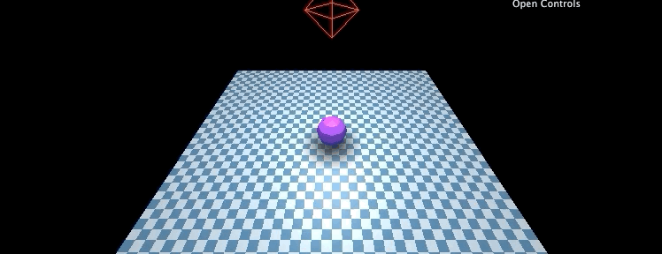

# Shadows
There are many ways to do shadows. We can use three to cast shadows from a point or directional light. We can also make fake shadows using a texture!

# Fake lights using a texture
Using a plane and a transparent texture we can make a fake shadow.

Make a plane with a shadow texture
```js
// Load texture
const shadowTexture = loader.load('./src/assets/roundshadow.png');

// Create a plane and apply the texture
const shadowGeometry = new THREE.PlaneBufferGeometry();
const shadowMaterial = new THREE.MeshBasicMaterial({ map: shadowTexture, transparent: true });
const shadowMesh = new THREE.Mesh(shadowGeometry, shadowMaterial);

// Move it above the ground plane and size it
shadowMesh.rotation.x = Math.PI * -0.5;
shadowMesh.position.y += 0.001;
shadowMesh.scale.set(5, 5, 5);

// Don't forget to add to scene :]
scene.add(shadowMesh);
```

Based on the height of the object we are making a shadow for we can adjust the opacity!
```js
shadowMesh.material.opacity = THREE.Math.lerp(1, 0.25, zeroToOne)
```

Example:

