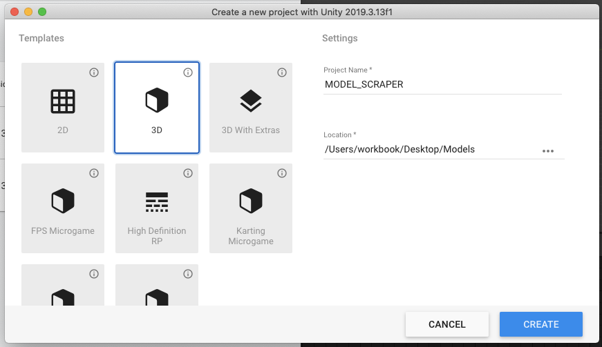
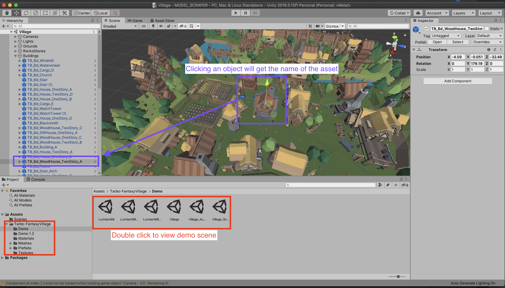
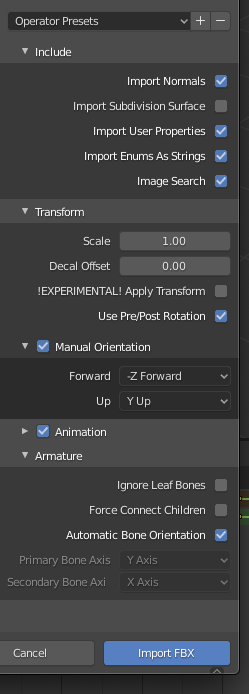
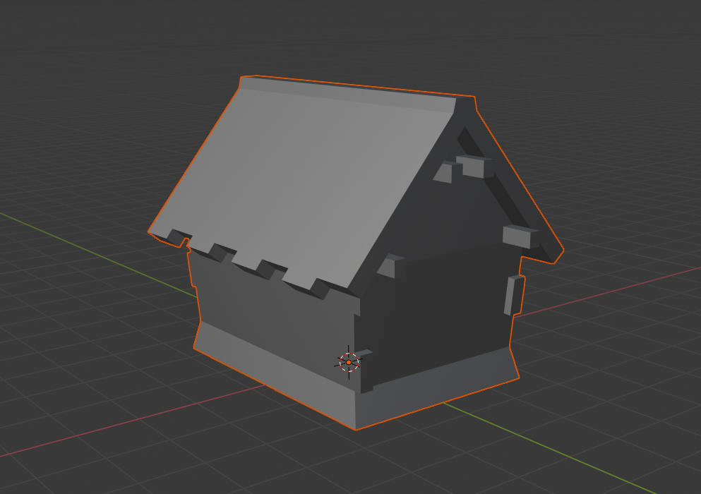
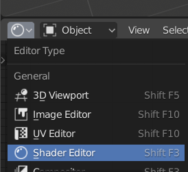
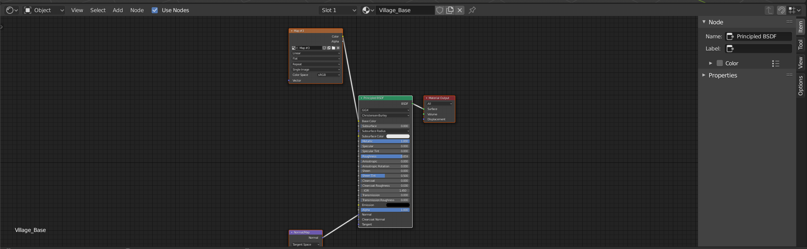
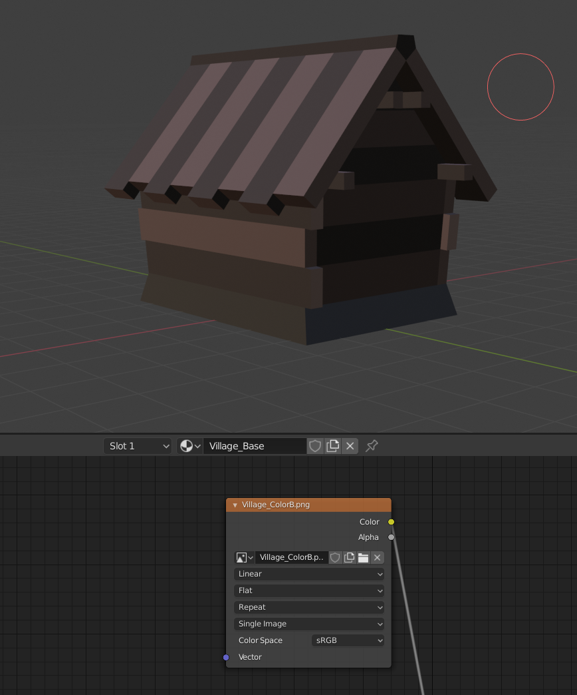

# Importing a model from Unity Asset Store into blender

1. Create a new blank unity project. 
> Save the project to a location you can find later
   
   - 

2. Click on the assets tab. Go to your assets
3. Download and import the asset into the project
4. Most asset packs seem to come with demo scenes. Double click them within assets 
> If it's a asset pack most of the structures are prefabs. Prefabs are combinations of many models. These will have to be put together again in blender or where you export them too
   
   - 
   
4. Navigate to the Unity Project folder in finder/explorer
5. There should be a meshes folder within in .FBX format
6. Open blender and delete the default scene
7. `File -> Import -> FBX -> Select to model you want` 
   - 
8. Now the model is all silver/purple with no textures
   - 
9. Split the view and switch it to `shader editor`
   - 
   - 
10. Find where the texture image is. `Ex. Map #3` and click the folder icon to open file. Navigate to `unity_project/Assets/asset_name/Textures` and select the texture
11. The model should now have a texture!
   - 

## Export it with textures
To export with textures within the file you need to export as `glft (.glb)`
